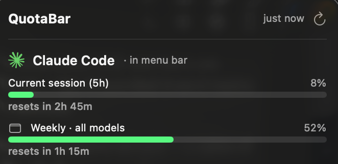

# UsageBar

> A tiny macOS menu bar app that shows how much of your AI-coding quota
> you've burned — green / yellow / red at a glance, with a click-through
> breakdown per provider.

<p align="center">
  
</p>

Runs alongside the CLIs and editors you already use. **Never asks you for an
API key** — it reuses each service's existing sign-in (Keychain, the tool's
own config file, or its state DB) and polls the same undocumented usage
endpoints the tool itself hits.

Supports **Claude Code**, **ChatGPT (Codex)**, **Cursor**, **GitHub
Copilot**, **SuperGrok**, and **Grok API** in a single icon, and is designed
so adding another provider is one small file, not a rewrite.

---

## Features

- Menu bar glyph shows the active provider's own brand mark, tinted **green**
  (< 70 %), **yellow** (70–90 %), or **red** (≥ 90 %) off the worst window.
- Optional percentage label next to the icon.
- Popover tabs — one per account across all providers — each with per-window
  progress bars and reset countdowns ("in 30d 3h", "in 12m").
- **Multi-account.** Multiple Claude Code accounts (each on its own
  `CLAUDE_CONFIG_DIR`) are auto-discovered from the login Keychain, one tab
  per account. GitHub Copilot multi-account works natively from `apps.json`.
- **One-button add-Claude-account** — opens a fresh sign-in for a second
  Anthropic account inside UsageBar, no Terminal, browser-based OAuth via
  your system default browser (so Google-signed-in accounts work too).
- **Per-account nicknames** — keyed by the account's email so they survive
  the underlying Keychain item being re-created.
- **Sign-in helper per provider** — one-click into Terminal (`codex login`),
  the Cursor app, or the GitHub Copilot docs, depending on the service.
- **Silent failure handling** — 429s and transient errors never surface to
  the user; the last known snapshot keeps showing while the app quietly
  backs off. Only sign-in-expired states get a small inline "Reconnect" link.
- **Delete** any account (default or extra) from Settings — removes the
  Keychain item, tab disappears immediately.
- **Diagnostics** — one-click "Copy diagnostics" in Settings dumps the app's
  full state (no credential data) so bug reports are actually actionable.
- No dock icon (`LSUIElement`), no analytics, no accounts, no daemon.

## Providers

| Service | Auth source | Endpoint | Windows exposed |
|---|---|---|---|
| Claude Code | login Keychain (`Claude Code-credentials`), or `~/.claude/.credentials.json` | `api.anthropic.com/api/oauth/usage` | Session (5 h), Weekly · all models, Weekly · per-model (Sonnet / Fable / …) |
| ChatGPT · Codex | `~/.codex/auth.json` | `chatgpt.com/backend-api/wham/usage` | Primary window (5 h / daily / weekly / …), Secondary window |
| Cursor | `~/Library/Application Support/Cursor/User/globalStorage/state.vscdb` (`cursorAuth/accessToken` JWT) | `cursor.com/api/usage-summary` | Auto models, Named models, Plan total, On-demand ($) |
| GitHub Copilot | `~/.config/github-copilot/apps.json` (or legacy `hosts.json`) | `api.github.com/copilot_internal/user` | One window per `quota_snapshots` entry (Premium requests, Chat, Completions, …) |
| SuperGrok | `~/.grok/auth.json` (Grok CLI `grok login`) | `cli-chat-proxy.grok.com/v1/billing?format=credits` | Weekly SuperGrok pool + per-product mix (Chat, Build, …) |
| Grok API | `~/.xai/api_key` (or `XAI_API_KEY` when launched from a shell) | `api.x.ai/v1/models` (key check) | No usage windows — a live key is connected; spend lives in console.x.ai |

New providers show up automatically for existing installs — the preference
store keeps a *disabled* list, not an enabled one.

## Requirements

- macOS 13 (Ventura) or later
- Apple Silicon or Intel
- Xcode Command Line Tools (Swift 5.9+; Xcode itself not required)
- A local sign-in to whichever service(s) you want to monitor

## Build & run

```bash
git clone https://github.com/agiveon/usagebar.git
cd usagebar
./build.sh release          # produces .build/UsageBar.app
open .build/UsageBar.app
```

Look for a colored brand icon in the menu bar. On first poll, Claude's
Keychain item will prompt for access — click **Always Allow** so subsequent
polls are silent.

## Privacy

UsageBar is deliberately quiet about your data:

- Auth tokens are **read fresh on every poll and never cached** — nothing
  sensitive is written to disk by this app.
- Only two categories of network traffic: (a) the four provider usage
  endpoints listed above, (b) nothing else.
- No analytics, no telemetry, no crash reporter, no update pings, no account.
- No Full Disk Access needed — everything lives under paths the app already
  has permission to read.
- Preferences (which providers are enabled, refresh interval, menu-bar metric
  choice) are stored in `UserDefaults` — user-scoped, not sensitive.

## Configuration

Right-click / left-click the icon → **Settings** (gear):

- **Providers** — check or uncheck each service. Disabled providers stop
  being polled and disappear from the popover.
- **Menu bar display** — which provider and which specific window (or
  "Worst window") drives the icon color. Toggle the percent label on/off.
- **Refresh interval** — 60 s to 600 s (default 120 s). 60 s is the floor
  — Anthropic's undocumented endpoints rate-limit hard below that once you
  have multiple accounts. The app also caches profile lookups for 30 min
  and silently backs off on 429s so you shouldn't need to touch this.

## Adding a provider

Every provider is a single Swift file conforming to
[`UsageProvider`](Sources/UsageBar/Providers/UsageProvider.swift): give it an
`id`, a `displayName`, an `iconAsset` (bundled SVG) or `iconName` (SF
Symbol), a `signInAction`, and two methods — `isAvailable()` and
`fetchSnapshot() -> UsageSnapshot`. Register it in
[`ProviderRegistry.default`](Sources/UsageBar/Providers/ProviderRegistry.swift)
and it appears in the Settings pane, the popover, and the menu-bar picker
with no further wiring.

See [CONTRIBUTING.md](CONTRIBUTING.md) for the walk-through.

## Not affiliated with

Anthropic, OpenAI, Cursor Inc., GitHub / Microsoft, WorkOS, or xAI. The brand
marks in [Sources/UsageBar/Resources/Icons](Sources/UsageBar/Resources/Icons)
belong to their respective owners; they're bundled here purely to identify
the corresponding service in the UI.

## Credits

Endpoints and response schemas were cross-checked against these working
open-source implementations — see [NOTICE.md](NOTICE.md) for the full list.

## License

[MIT](LICENSE).
